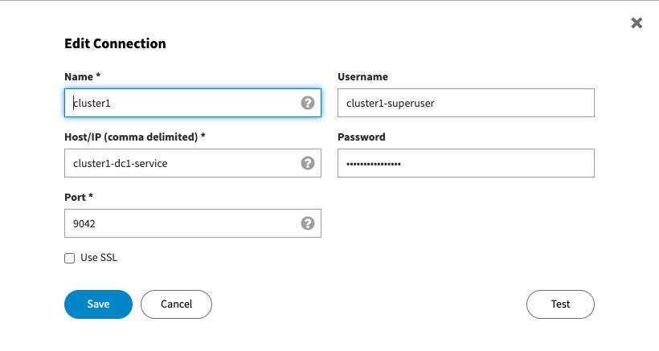

Connect Datastax Studio
=======================

Pre-requisites
--------------
Before you start, make sure you have performed the following tasks:

* GKE: :doc:`../../cloud/gcp/create-cluster` and :doc:`../../cloud/gcp/connect-cluster`
* :doc:`../setup/install-cass-operator`
* :doc:`../provision/create-datacenter`
* :doc:`../setup/studio`
* :doc:`../manage/credentials`

Procedure
---------
* From Studio, add a new connection as show below:

Post-requisites
---------------
* Test the connection using Studio or use one of the example notebooks to test the connection