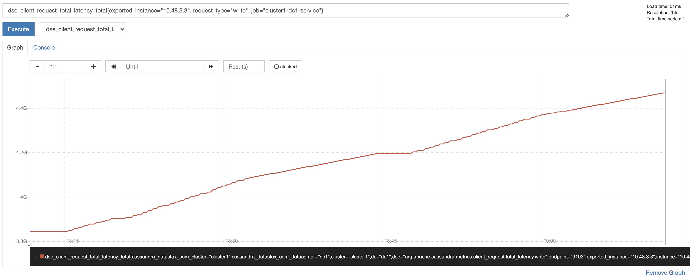
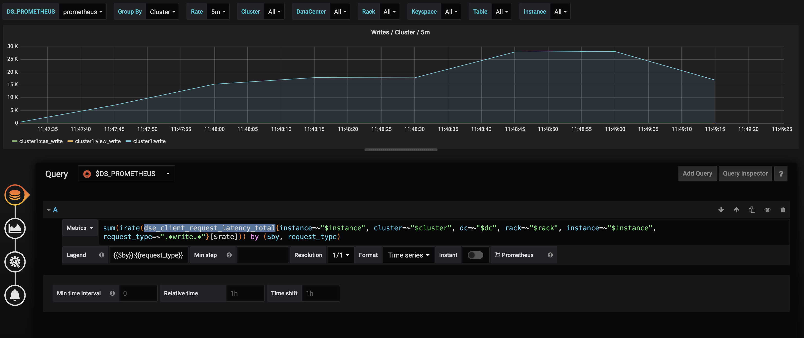

Metric
======
This recipe will help you to view the metrics collected by prometheus directly.

Pre-requisites
--------------
Before you start, make sure you have performed the following tasks:

* :doc:`./operator`
* :doc:`./service`
* :doc:`./instance`

Procedure
---------
* Expose the prometheus port:

.. code-block:: shell

   $> kubectl port-forward -n cass-operator svc/prometheus-operated 9090:9090

* Check your metric as shown on the image:

* If you want to know which metric is being used by a graph, edit the graph as show in the image:

Post-requisites
---------------
